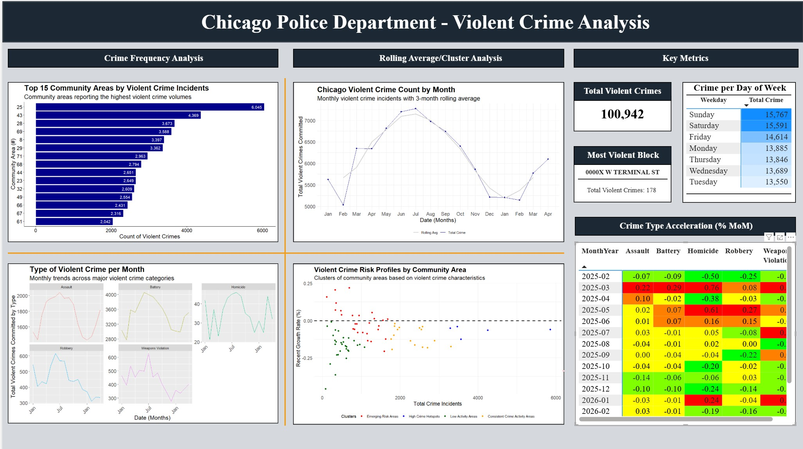

# Chicago Violent Crimes Analysis

## Overview

This project analyzes violent crime incidents in Chicago to identify crime hotspots, emerging risk areas, and temporal crime trends

## Dashboard Preview

## Tools

-	SQL Server
-	R
-	Power BI

## Analytical Techniques Used

-  Data aggregation and transformation
-	Window functions and ranking analysis
-	Time-series trend analysis
-	Rolling average calculations
-	Geographic hotspot analysis
-	Month-over-month growth analysis
-	K-means clustering
-	Community risk segmentation
-	KPI development
-	Interactive dashboard design

## Key Findings

-	Area 25 accounted for the highest violent crime volume
-	Violent crime peaked during summer months
-	Several low-volume areas exhibited above-average growth rates
-	Battery and assault drive the majority of violent crime incidents
-	Weekends experience higher violent crime counts compared to weekdays
